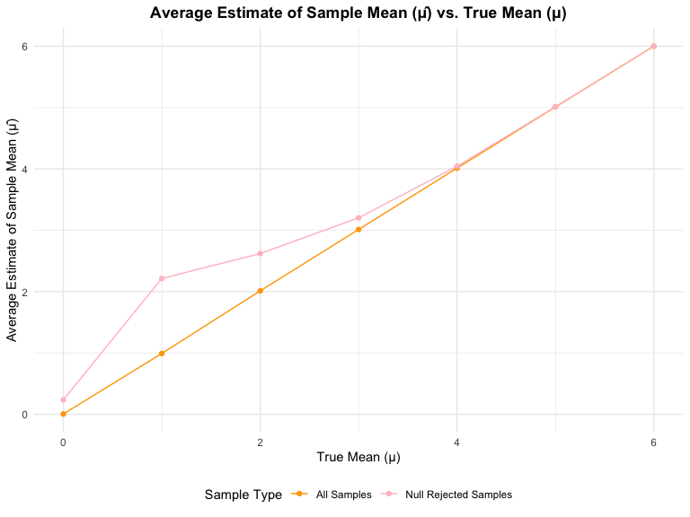

p8105_hw5_dw3093
================
Katherine Wang

\#Question 1

``` r
shared_bday <- function(n) {
  bday <- sample(1:365, size = n, replace = TRUE) 
  return(any(duplicated(bday)))
}
group_sizes <- 2:50
n_simulation <- 10000

prob <- numeric(length(group_sizes))
for (i in seq_along(group_sizes)) {
  group_size <- group_sizes[i]

  results <- replicate(n_simulation, shared_bday(group_size))
  prob[i] <- mean(results)
}
results <- data.frame(
  group_size = group_sizes,
  probability = prob
)

ggplot(results, aes(x = group_size, y = probability)) +
  geom_line() +
  geom_point(alpha=.6) +
  labs(
    title = "Probability of Shared Birthday as a Function of Group Size",
    x = "Group Size (n)",
    y = "Probability of Shared Birthday"
  ) +
  theme(
    plot.title = element_text(hjust = 0.5, face = "bold")
  )
```


We can conclude that the probability of a shared birthday is low with
small group sizes. However, as the group size increases, the probability
rises sharply, reaching over 50% by around 23 people and approaching
near certainty by 50 people.

# Question 2

# Set up parameters as question required

``` r
n <- 30
sigma <- 5
alpha <- 0.05
mu_values <- 0:6
n_simulations <- 5000
```

# Function to simulate data

``` r
t_test <- function(mu) {
  sample_data <- rnorm(n = n, mean = mu, sd = sigma)
  t_stats <- t.test(sample_data, mu = 0) |>
    broom::tidy() |>
    select(estimate, p.value)
  return(t_stats)
}
```

# Generate simulation results for each mu value

``` r
simulation_results <- tibble(
  mu = rep(mu_values, each = n_simulations)
) |>
  mutate(
    t_test_output = map(mu, t_test)
  ) |>
  unnest(cols = t_test_output)
```

# Calculate power and average estimates

``` r
summary_results <- simulation_results |>
  group_by(mu) |>
  summarize(
    power = mean(p.value < alpha),
    avg_est_all = mean(estimate),
    avg_est_rej = mean(estimate[p.value < alpha], na.rm = TRUE),
    .groups = 'drop'
  )
```

# Plot 1: Power of the t-test vs. True Value of μ

``` r
ggplot(summary_results, aes(x = mu, y = power)) +
  geom_line() +
  geom_point() +
  labs(
    title = "Power of the t-test vs. True Value of μ",
    x = "True Value of μ",
    y = "Power (Proportion of Null Rejections)"
  ) +
  theme(
    plot.title = element_text(hjust = 0.5, face = "bold")
)
```


This plot shows how the true value of μ influences the power of the
t-test. As the true mean μ increases, the power of the test rises
correspondingly. This trend reflects a greater likelihood of rejecting
the null hypothesis as the effect size grows, suggesting that the test
becomes more effective at detecting a true difference from 0 when μ is
larger. Consequently, higher values of μ yield a higher probability of
rejecting the null hypothesis rises

# Plot 2: Average Estimate vs. True Mean (μ)

``` r
ggplot(summary_results, aes(x = mu)) +
  geom_line(aes(y = avg_est_all, color = "All Samples")) +
  geom_point(aes(y = avg_est_all, color = "All Samples")) +
  geom_line(aes(y = avg_est_rej, color = "Null Rejected Samples")) +
  geom_point(aes(y = avg_est_rej, color = "Null Rejected Samples")) +
  labs(
    title = "Average Estimate of Sample Mean (μ̂) vs. True Mean (μ)",
    x = "True Mean (μ)",
    y = "Average Estimate of Sample Mean (μ̂)",
    color = "Sample Type"
  ) +
  scale_color_manual(
    values = c("All Samples" = "orange", "Null Rejected Samples" = "pink"),
    labels = c("All Samples", "Null Rejected Samples")
  ) +
  theme(
    plot.title = element_text(hjust = 0.5, face = "bold")
)
```


This plot shows the average estimate of μ^ for all samples (orange) and
for only those samples where the null was rejected (pink), across
different values of the true mean μ.

No, the sample average of μ^ across tests where the null hypothesis is
rejected is not approximately equal to the true value of μ, especially
for smaller values of μ.

This discrepancy arises due to selection bias. When we focus only on
tests that reject the null hypothesis, we tend to include samples with
larger-than-average estimates of μ^, as these are more likely to yield
significant p-values. Consequently, the observed average in this subset
is inflated. However, as the true value of μ becomes larger, this bias
diminishes because the true effect is strong enough that a broader range
of sample estimates lead to significance, resulting in an average
estimate closer to the true value of μ.

# Question 3

# Load dataset from github

``` r
homicide = read_csv("https://raw.githubusercontent.com/washingtonpost/data-homicides/refs/heads/master/homicide-data.csv")
```

    ## Rows: 52179 Columns: 12
    ## ── Column specification ────────────────────────────────────────────────────────
    ## Delimiter: ","
    ## chr (9): uid, victim_last, victim_first, victim_race, victim_age, victim_sex...
    ## dbl (3): reported_date, lat, lon
    ## 
    ## ℹ Use `spec()` to retrieve the full column specification for this data.
    ## ℹ Specify the column types or set `show_col_types = FALSE` to quiet this message.

``` r
summary(homicide)
```

    ##      uid            reported_date       victim_last        victim_first      
    ##  Length:52179       Min.   : 20070101   Length:52179       Length:52179      
    ##  Class :character   1st Qu.: 20100318   Class :character   Class :character  
    ##  Mode  :character   Median : 20121216   Mode  :character   Mode  :character  
    ##                     Mean   : 20130899                                        
    ##                     3rd Qu.: 20150911                                        
    ##                     Max.   :201511105                                        
    ##                                                                              
    ##  victim_race         victim_age         victim_sex            city          
    ##  Length:52179       Length:52179       Length:52179       Length:52179      
    ##  Class :character   Class :character   Class :character   Class :character  
    ##  Mode  :character   Mode  :character   Mode  :character   Mode  :character  
    ##                                                                             
    ##                                                                             
    ##                                                                             
    ##                                                                             
    ##     state                lat             lon          disposition       
    ##  Length:52179       Min.   :25.73   Min.   :-122.51   Length:52179      
    ##  Class :character   1st Qu.:33.77   1st Qu.: -96.00   Class :character  
    ##  Mode  :character   Median :38.52   Median : -87.71   Mode  :character  
    ##                     Mean   :37.03   Mean   : -91.47                     
    ##                     3rd Qu.:40.03   3rd Qu.: -81.76                     
    ##                     Max.   :45.05   Max.   : -71.01                     
    ##                     NA's   :60      NA's   :60

This dataset contains 52179 records on homicide incidents, each with 12
columns. Each entry includes a unique identifier (uid), report date
(reported_date), and victim details such as last name (victim_last),
first name (victim_first), race (victim_race), age (victim_age), and sex
(victim_sex). Location is specified by city, state, and geographic
coordinates (lat and lon). The (disposition) shows the case outcome.

I found there is a repeated entry of Tulsa, AL, and Tulsa, OK, it seems
a data entry error, by Google the city of Tulsa, I noticed that Tulsa,
AL is wrong. So, will conduct further data cleaning.

# Create city_state variable and summarize

``` r
homicide_sum <- homicide %>%
  mutate(city_state = paste(city, state, sep = ", ")) %>%
  group_by(city_state) %>%
  summarise(
    total_homicides = n(),
    unsolved_homicides = sum(disposition %in% c("Closed without arrest", "Open/No arrest")),
    .groups = 'drop'
  ) %>% 
  filter(city_state!="Tulsa, AL")

knitr::kable(homicide_sum)
```

| city_state         | total_homicides | unsolved_homicides |
|:-------------------|----------------:|-------------------:|
| Albuquerque, NM    |             378 |                146 |
| Atlanta, GA        |             973 |                373 |
| Baltimore, MD      |            2827 |               1825 |
| Baton Rouge, LA    |             424 |                196 |
| Birmingham, AL     |             800 |                347 |
| Boston, MA         |             614 |                310 |
| Buffalo, NY        |             521 |                319 |
| Charlotte, NC      |             687 |                206 |
| Chicago, IL        |            5535 |               4073 |
| Cincinnati, OH     |             694 |                309 |
| Columbus, OH       |            1084 |                575 |
| Dallas, TX         |            1567 |                754 |
| Denver, CO         |             312 |                169 |
| Detroit, MI        |            2519 |               1482 |
| Durham, NC         |             276 |                101 |
| Fort Worth, TX     |             549 |                255 |
| Fresno, CA         |             487 |                169 |
| Houston, TX        |            2942 |               1493 |
| Indianapolis, IN   |            1322 |                594 |
| Jacksonville, FL   |            1168 |                597 |
| Kansas City, MO    |            1190 |                486 |
| Las Vegas, NV      |            1381 |                572 |
| Long Beach, CA     |             378 |                156 |
| Los Angeles, CA    |            2257 |               1106 |
| Louisville, KY     |             576 |                261 |
| Memphis, TN        |            1514 |                483 |
| Miami, FL          |             744 |                450 |
| Milwaukee, wI      |            1115 |                403 |
| Minneapolis, MN    |             366 |                187 |
| Nashville, TN      |             767 |                278 |
| New Orleans, LA    |            1434 |                930 |
| New York, NY       |             627 |                243 |
| Oakland, CA        |             947 |                508 |
| Oklahoma City, OK  |             672 |                326 |
| Omaha, NE          |             409 |                169 |
| Philadelphia, PA   |            3037 |               1360 |
| Phoenix, AZ        |             914 |                504 |
| Pittsburgh, PA     |             631 |                337 |
| Richmond, VA       |             429 |                113 |
| Sacramento, CA     |             376 |                139 |
| San Antonio, TX    |             833 |                357 |
| San Bernardino, CA |             275 |                170 |
| San Diego, CA      |             461 |                175 |
| San Francisco, CA  |             663 |                336 |
| Savannah, GA       |             246 |                115 |
| St. Louis, MO      |            1677 |                905 |
| Stockton, CA       |             444 |                266 |
| Tampa, FL          |             208 |                 95 |
| Tulsa, OK          |             583 |                193 |
| Washington, DC     |            1345 |                589 |

Here, the city_state variable is created to combine city and state
names, and then a summary of total and unsolved homicides is generated
for each city. The city “Tulsa, AL” is filtered out bef\$ore displaying
the table.

``` r
baltimore_data <- homicide_sum %>%
  filter(city_state == "Baltimore, MD")

baltimore_test <- prop.test(
  x = baltimore_data$unsolved_homicides,
  n = baltimore_data$total_homicides
) %>%
  broom::tidy()

baltimore_result <- baltimore_test %>% 
  select(estimate, conf.low, conf.high) %>%
  mutate(city_state = "Baltimore, MD")

knitr::kable(baltimore_result, 
             col.names = c("Estimate", "Lower CI", "Upper CI", "City, State"))
```

|  Estimate |  Lower CI |  Upper CI | City, State   |
|----------:|----------:|----------:|:--------------|
| 0.6455607 | 0.6275625 | 0.6631599 | Baltimore, MD |

I filtered the dataset for “Baltimore, MD” and use prop.test to estimate
the proportion of homicides that remain unsolved. The output from
prop.test is processed with broom::tidy() to extract the estimated
proportion and confidence interval. This table shows that approximately
64.6% of homicides in Baltimore, MD, remain unsolved, with a 95%
confidence interval of 62.8% to 66.3%.

``` r
unsolved_prop <- function(unsolved, total){
  prop_test_result <- prop.test(unsolved, total)
  broom::tidy(prop_test_result) %>% 
    select(estimate, conf.low, conf.high)
}
homicide_sum <- homicide_sum %>% 
  mutate(
    prop_results = purrr::map2(unsolved_homicides, 
                               total_homicides, 
                               ~unsolved_prop(.x, .y)
                               )
  ) %>%
  unnest(prop_results)

knitr::kable(homicide_sum)
```

| city_state         | total_homicides | unsolved_homicides |  estimate |  conf.low | conf.high |
|:-------------------|----------------:|-------------------:|----------:|----------:|----------:|
| Albuquerque, NM    |             378 |                146 | 0.3862434 | 0.3372604 | 0.4375766 |
| Atlanta, GA        |             973 |                373 | 0.3833505 | 0.3528119 | 0.4148219 |
| Baltimore, MD      |            2827 |               1825 | 0.6455607 | 0.6275625 | 0.6631599 |
| Baton Rouge, LA    |             424 |                196 | 0.4622642 | 0.4141987 | 0.5110240 |
| Birmingham, AL     |             800 |                347 | 0.4337500 | 0.3991889 | 0.4689557 |
| Boston, MA         |             614 |                310 | 0.5048860 | 0.4646219 | 0.5450881 |
| Buffalo, NY        |             521 |                319 | 0.6122841 | 0.5687990 | 0.6540879 |
| Charlotte, NC      |             687 |                206 | 0.2998544 | 0.2660820 | 0.3358999 |
| Chicago, IL        |            5535 |               4073 | 0.7358627 | 0.7239959 | 0.7473998 |
| Cincinnati, OH     |             694 |                309 | 0.4452450 | 0.4079606 | 0.4831439 |
| Columbus, OH       |            1084 |                575 | 0.5304428 | 0.5002167 | 0.5604506 |
| Dallas, TX         |            1567 |                754 | 0.4811742 | 0.4561942 | 0.5062475 |
| Denver, CO         |             312 |                169 | 0.5416667 | 0.4846098 | 0.5976807 |
| Detroit, MI        |            2519 |               1482 | 0.5883287 | 0.5687903 | 0.6075953 |
| Durham, NC         |             276 |                101 | 0.3659420 | 0.3095874 | 0.4260936 |
| Fort Worth, TX     |             549 |                255 | 0.4644809 | 0.4222542 | 0.5072119 |
| Fresno, CA         |             487 |                169 | 0.3470226 | 0.3051013 | 0.3913963 |
| Houston, TX        |            2942 |               1493 | 0.5074779 | 0.4892447 | 0.5256914 |
| Indianapolis, IN   |            1322 |                594 | 0.4493192 | 0.4223156 | 0.4766207 |
| Jacksonville, FL   |            1168 |                597 | 0.5111301 | 0.4820460 | 0.5401402 |
| Kansas City, MO    |            1190 |                486 | 0.4084034 | 0.3803996 | 0.4370054 |
| Las Vegas, NV      |            1381 |                572 | 0.4141926 | 0.3881284 | 0.4407395 |
| Long Beach, CA     |             378 |                156 | 0.4126984 | 0.3629026 | 0.4642973 |
| Los Angeles, CA    |            2257 |               1106 | 0.4900310 | 0.4692208 | 0.5108754 |
| Louisville, KY     |             576 |                261 | 0.4531250 | 0.4120609 | 0.4948235 |
| Memphis, TN        |            1514 |                483 | 0.3190225 | 0.2957047 | 0.3432691 |
| Miami, FL          |             744 |                450 | 0.6048387 | 0.5685783 | 0.6400015 |
| Milwaukee, wI      |            1115 |                403 | 0.3614350 | 0.3333172 | 0.3905194 |
| Minneapolis, MN    |             366 |                187 | 0.5109290 | 0.4585150 | 0.5631099 |
| Nashville, TN      |             767 |                278 | 0.3624511 | 0.3285592 | 0.3977401 |
| New Orleans, LA    |            1434 |                930 | 0.6485356 | 0.6231048 | 0.6731615 |
| New York, NY       |             627 |                243 | 0.3875598 | 0.3494421 | 0.4270755 |
| Oakland, CA        |             947 |                508 | 0.5364308 | 0.5040588 | 0.5685037 |
| Oklahoma City, OK  |             672 |                326 | 0.4851190 | 0.4467861 | 0.5236245 |
| Omaha, NE          |             409 |                169 | 0.4132029 | 0.3653146 | 0.4627477 |
| Philadelphia, PA   |            3037 |               1360 | 0.4478103 | 0.4300380 | 0.4657157 |
| Phoenix, AZ        |             914 |                504 | 0.5514223 | 0.5184825 | 0.5839244 |
| Pittsburgh, PA     |             631 |                337 | 0.5340729 | 0.4942706 | 0.5734545 |
| Richmond, VA       |             429 |                113 | 0.2634033 | 0.2228571 | 0.3082658 |
| Sacramento, CA     |             376 |                139 | 0.3696809 | 0.3211559 | 0.4209131 |
| San Antonio, TX    |             833 |                357 | 0.4285714 | 0.3947772 | 0.4630331 |
| San Bernardino, CA |             275 |                170 | 0.6181818 | 0.5576628 | 0.6753422 |
| San Diego, CA      |             461 |                175 | 0.3796095 | 0.3354259 | 0.4258315 |
| San Francisco, CA  |             663 |                336 | 0.5067873 | 0.4680516 | 0.5454433 |
| Savannah, GA       |             246 |                115 | 0.4674797 | 0.4041252 | 0.5318665 |
| St. Louis, MO      |            1677 |                905 | 0.5396541 | 0.5154369 | 0.5636879 |
| Stockton, CA       |             444 |                266 | 0.5990991 | 0.5517145 | 0.6447418 |
| Tampa, FL          |             208 |                 95 | 0.4567308 | 0.3881009 | 0.5269851 |
| Tulsa, OK          |             583 |                193 | 0.3310463 | 0.2932349 | 0.3711192 |
| Washington, DC     |            1345 |                589 | 0.4379182 | 0.4112495 | 0.4649455 |

``` r
homicide_sum |>
mutate(
    city_state = reorder(city_state, estimate)
  )|>
ggplot(aes(x = city_state, y = estimate)) +
  geom_point(color = "pink") +
  geom_errorbar(aes(ymin = conf.low, ymax = conf.high), width = 0.2) +
  labs(
    title = "Proportion of Unsolved Homicides by City",
    x = "City, State",
    y = "Proportion of Unsolved Homicides"
  ) +
  theme(
    axis.text.x = element_text(angle = 45, hjust = 1),
    axis.text = element_text(size = 8),
    plot.title = element_text(hjust = 0.5, face = "bold")
  )
```


This plot displays the estimated proportions of unsolved homicides for
each city, with error bars representing the 95% CI. Cities are organized
in ascending order of unsolved homicide proportions, ranging from around
30% in Richmond, VA, to around 75% in New Orleans, LA.
