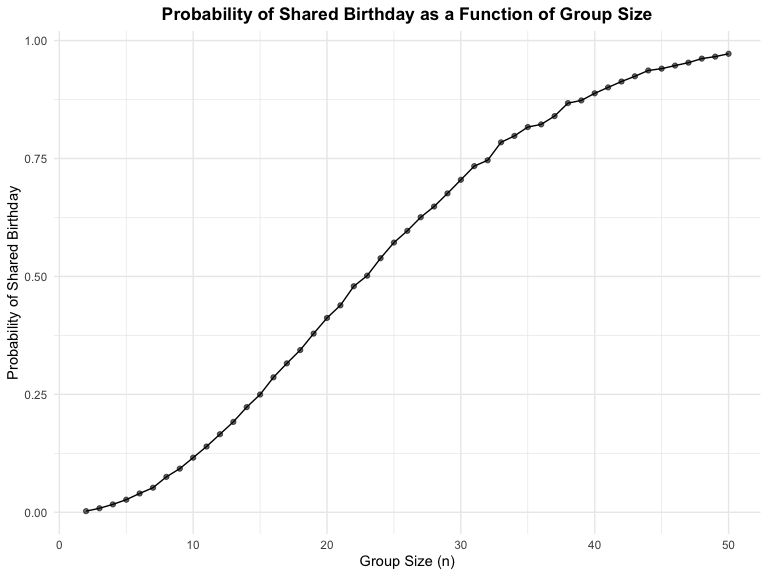

p8105_hw5_dw3093
================
Katherine Wang

\#Question 1

``` r
shared_bday <- function(n) {
  bday <- sample(1:365, size = n, replace = TRUE) 
  return(any(duplicated(bday)))
}
group_sizes <- 2:50
n_simulation <- 10000

prob <- numeric(length(group_sizes))
for (i in seq_along(group_sizes)) {
  group_size <- group_sizes[i]

  results <- replicate(n_simulation, shared_bday(group_size))
  prob[i] <- mean(results)
}
results <- data.frame(
  group_size = group_sizes,
  probability = prob
)

ggplot(results, aes(x = group_size, y = probability)) +
  geom_line() +
  geom_point(alpha=.6) +
  labs(
    title = "Probability of Shared Birthday as a Function of Group Size",
    x = "Group Size (n)",
    y = "Probability of Shared Birthday"
  ) +
  theme(
    plot.title = element_text(hjust = 0.5, face = "bold")
  )
```


We can conclude that the probability of a shared birthday is low with
small group sizes. However, as the group size increases, the probability
rises sharply, reaching over 50% by around 23 people and approaching
near certainty by 50 people.

\#Question 2 Set up parameters as question required

``` r
n <- 30
sigma <- 5
alpha <- 0.05
mu_values <- 0:6
n_simulations <- 5000
```

Function to simulate data

``` r
t_test <- function(mu) {
  x <- rnorm(n = n, mean = mu, sd = sigma)
  t_stats <- t.test(x, mu = 0) |>
    broom::tidy() |>
    select(estimate, p.value) 
  return(t_stats)
}
```

Generate simulation results for each mu value

``` r
simulation_results <- tibble(
  mu = rep(mu_values, each = n_simulations),
  iter = rep(1:n_simulations, times = length(mu_values))
) |>
  mutate(
    t_test_output = map(mu, t_test)
  ) |>
  unnest(cols = t_test_output)
```
